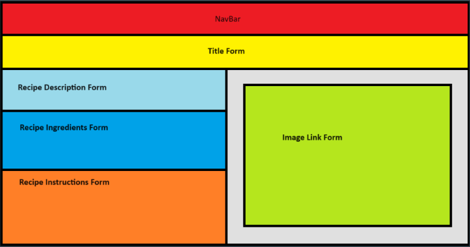
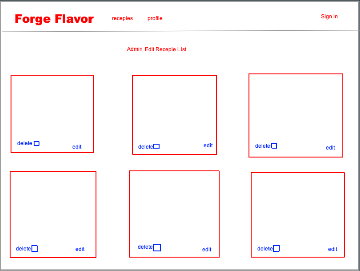
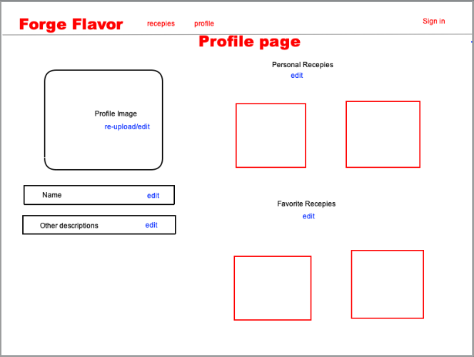
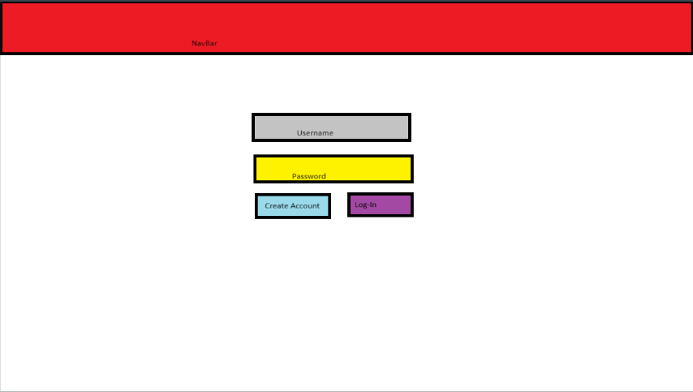

# FlavorForge: Recipes for minimal kitchens and minimal cost

## Overview

FlavorForge aims to revolutionize how college students approach cooking by providing a platform where they can easily discover and share recipes that are tailored to their limited resources and dietary preferences. Our goal is to empower students to cook nutritious and delicious meals using minimal kitchen facilities and ingredients that are readily available near their campus.

## Our Vision

* Allow students to share and view recipes
* Students will be able to sort recipes by categories
* User can give a budget and recipes will be shown by price

### Home Page

The home page will be the first page seen when logged in. There will be a main image, information about the website and a featured recipe. The navbar at the top will have links leading to the other pages

### Recipe Page

The recipe page will have the name of the recipe at the top, a descripton of the dish, the recipe's ingredients, and the recipe instructions. On the right of the recipe information will be an image of the dish.

### Edit Recipe Page

This page will be basically the same as the recipe page, but using forms in each section instead of text.

### Recipe List Page

This page will show a list of recipes in the form of cards. Each card will have the name of the dish, an image of the dish, and its cost.

### Edit Recipe List Page

This page will be similar to the recipe list page, but will have a delete button and an edit button. It will only be available by admins.

### Profile Page

This page will have a profile picture, a profile name, and any optional information. Recipes the user posted and the user's favorite recipes will be shown on the right.

### Edit Profile Page

This page will allow the user to reupload a profile picture and edit information and their associated recipes.

### Login Page

This is the first page that is shown when opening the site. This is where a user can both login and sign up with a form.

### Team

Team members:
* [Weibin Wu](https://github.com/Weibin808).
* [Junjie Yu](https://github.com/junjieyu808).
* [Jason Aguda](https://github.com/Jaguda01).
* [Christian Yang](https://github.com/ccyang617).
* [Angello Portello](https://github.com/AngePort).

[M1 Project](https://github.com/orgs/Lovin-Toaster-Oven/projects/1).