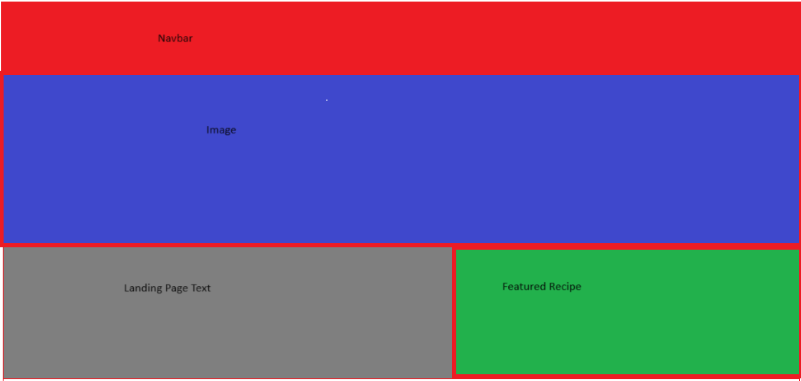
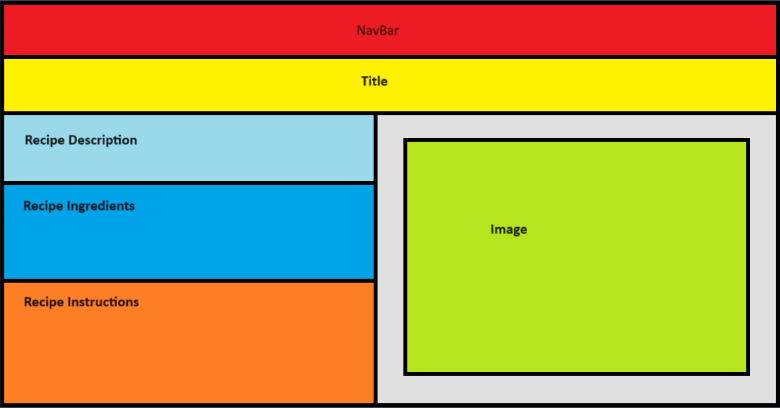
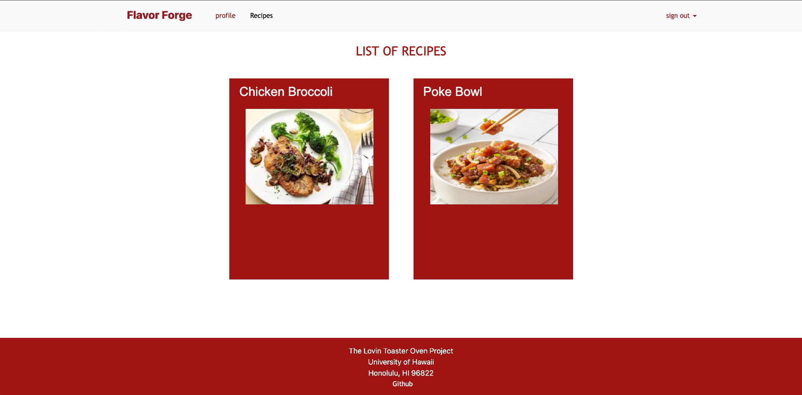
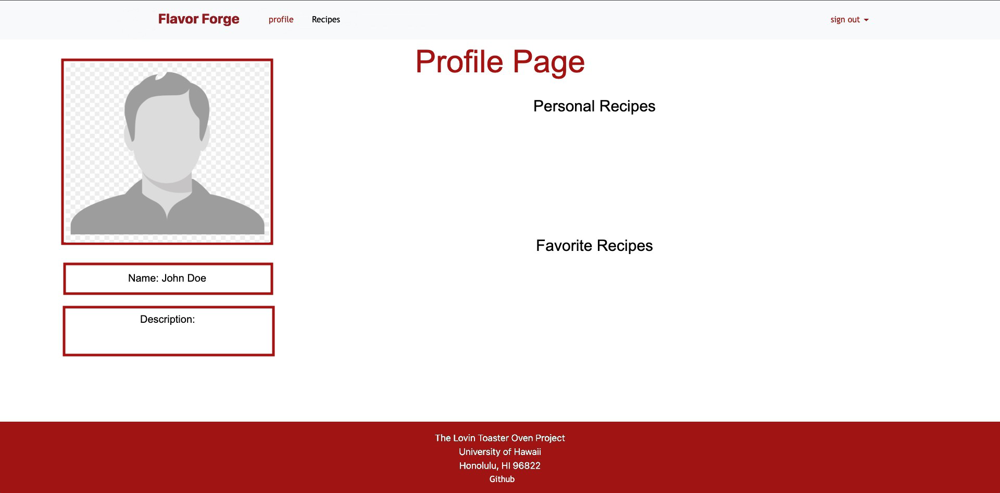

# FlavorForge <br/> Let us cook

Welcome to FlavorForge, your go-to platform for affordable and delicious recipes tailored for college students! Here's everything you need to know about our project:

## Overview

FlavorForge is designed to revolutionize the way college students approach cooking. Our platform provides a space where students can easily discover and share recipes that are perfectly suited to their limited resources and dietary preferences. Our goal is to empower students to cook nutritious and tasty meals using minimal kitchen facilities and readily available ingredients near their campus.

## User Guide

### Home Page

Our homepage serves as the central hub of FlavorForge. Here's what you can find:

- **Main Image**: Captivating visuals to entice your culinary senses.
- **Website Information**: A brief overview of FlavorForge and its mission.
- **Featured Recipe**: A spotlight on one of our top recipes to inspire your next cooking adventure.
- **Navigation Bar**: Quick access to other sections of the website.



### Recipe Page

Dive into the details of each recipe on our Recipe Page:

- **Recipe Name**: Clearly labeled at the top for easy reference.
- **Rating**: Users can rate the recipe from 0 to 5 starts
- **Description**: Learn about the dish and what makes it special.
- **Ingredients**: A list of all the ingredients you'll need.
- **Instructions**: Step-by-step guide to cooking the perfect dish.
- **Image**: Visual representation of the final product.



### Recipe List Page

Browse through our collection of recipes with ease on the Recipe List Page:

- **Recipe Cards**: Each card displays the dish name, image, and cost.
- **Cost**: See how budget-friendly each recipe is at a glance.



### Profile Page

Customize your FlavorForge experience on your Profile Page:

- **Profile Picture**: Personalize your profile with a picture.
- **Profile Name**: Your unique identifier on FlavorForge.
- **User Information**: Optional details to share with the community.
- **Posted Recipes**: Showcase your culinary creations.
- **Favorite Recipes**: Keep track of recipes you love.



## Community Feedback

We gathered feedback from five community members who tried out FlavorForge. Here's what we learned:

[Include findings from community feedback here.]

## Developer Guide

Ready to dive into development? Follow these steps:

1. Install [Meteor](https://docs.meteor.com/install.html).
2. Clone the [Flavor-Forge repository](https://github.com/Flavor-Forge) to your local machine.
3. Navigate to the `bowfolios/app` directory.
4. Install dependencies with:
   ```sh
   $ meteor npm install
   $ meteor npm install --save react-star-ratings
   ```
5. Run the system:
   ```sh
   $ meteor npm run start
   ```
6. Access the application at [http://localhost:3000/](http://localhost:3000/).

## Links

- **GitHub Organization**: [Flavor-Forge](https://github.com/Flavor-Forge)
- **Running Deployment**: [FlavorForge on Digital Ocean](http://159.223.193.159)
- **M1 Project**: [M1 Project Page](https://github.com/orgs/Flavor-Forge/projects/1)
- **M2 Project**: [M2 Project Page](https://github.com/orgs/Flavor-Forge/projects/3)
- **M3 Project**: [M3 Project Page](https://github.com/orgs/Flavor-Forge/projects/5)

Thank you for being a part of the FlavorForge community! Happy cooking! 🍳🔥
