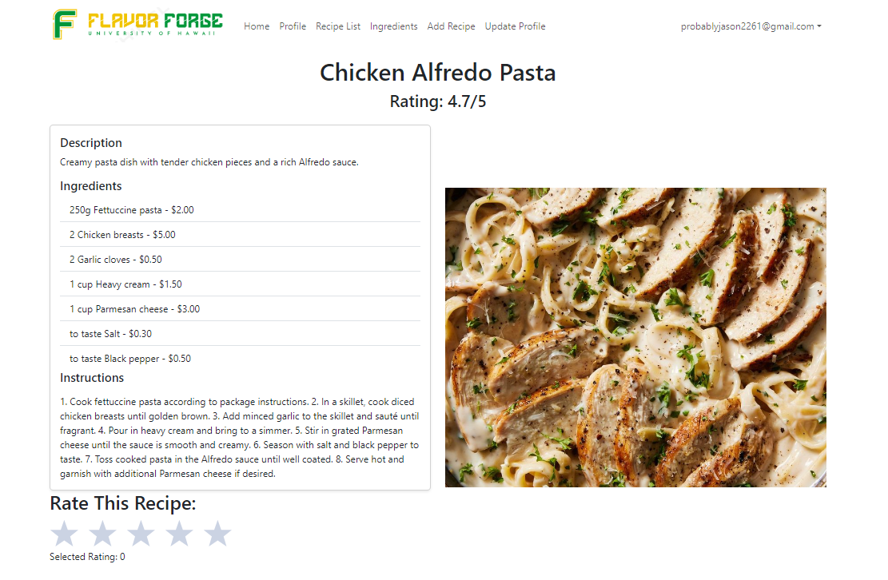
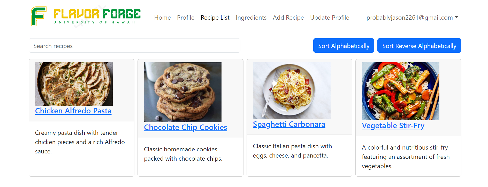
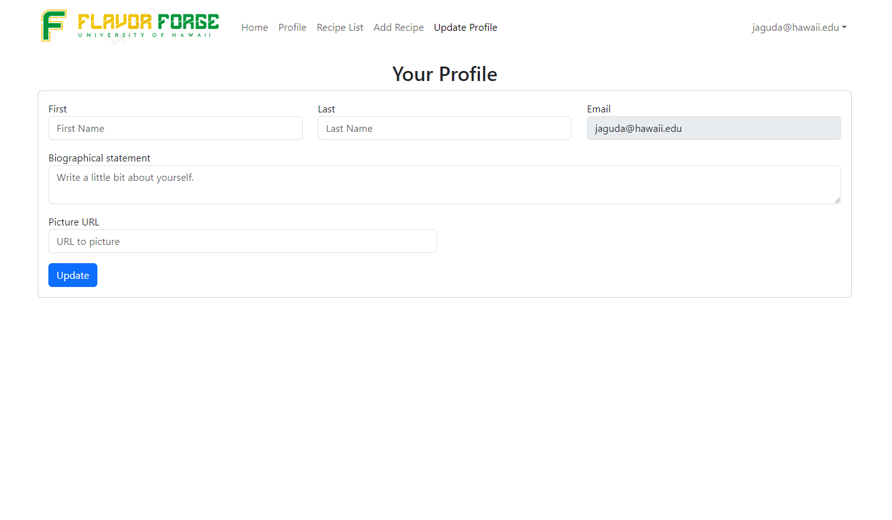

# FlavorForge: <br/> Let us cook

Welcome to FlavorForge, your go-to platform for affordable and delicious recipes tailored for college students! Here's everything you need to know about our project:

## Overview

FlavorForge's purpose is to facilitate college students and their budget. Our platform provides a space where students can easily discover and share recipes that are perfectly suited to their limited resources and dietary preferences. Our goal is to empower students to cook nutritious and tasty meals using minimal kitchen facilities and readily available ingredients near their campus. Campus meal plans and on-campus restaurants can be expensive and FlavorForge is here to help students save without sacrificing flavor.

## User Guide

### Home Page

Our homepage serves as the central hub of FlavorForge. Here's what you can find:

- **Main Image**: Captivating visuals to entice your culinary senses.
- **Website Information**: A brief overview of FlavorForge and its mission.
- **Featured Recipe**: A spotlight on one of our top recipes to inspire your next cooking adventure.
- **Navigation Bar**: Quick access to other sections of the website.


### Recipe Page

The Recipe Page displays the description, ingredients, and instructions for each recipe. It also displays a picture of the recipe and allows the user to submit a rating (0-5 stars). If you are the user that created this recipe then the page also includes an 'Edit Recipe' button that will allow you to make any changes necessary to the recipe.

- **Recipe Name**: Clearly labeled at the top for easy reference.
- **Rating**: Users can rate the recipe from 0 to 5 starts
- **Description**: Learn about the dish and what makes it special.
- **Ingredients**: A list of all the ingredients you'll need.
- **Instructions**: Step-by-step guide to cooking the perfect dish.
- **Image**: Visual representation of the final product.



### Recipe List Page

Browse through our collection of recipes with ease on the Recipe List Page. This page will display the entire collection of recipes that FlavorForge has to offer. Each card provides a preview of what each recipe has to offer.

- **Recipe Cards**: Each card displays the dish name, image, and description
- **Recipe Link**: Clicking on the name leads to the page associated with the recipe
- **Filter Bar**: Here you can type the name of your recipe to search for it or simply type a letter to sort.



### Profile Page

Customize your FlavorForge experience on your Profile Page.

- **Profile Picture**: Personalize your profile with a picture.
- **Profile Name**: Your unique identifier on FlavorForge.
- **User Information**: Optional details to share with the community.
- **Posted Recipes**: Showcase your culinary creations.
- **Favorite Recipes**: Keep track of recipes you love.


### Update Profile Page

If you ever want to change your information, FlavorForge has you covered:
-**Update Name**: Simply type your new name to change.
-**Biographical Statement**: Give a short bio about yourself, tell us how you started cooking or what your favorite foods are.
-**Picture URL**: Simply enter a link to a picture online to make it your personal avatar.



### Add Recipe Page

This page allows you to add your recipe for the community to see. Get started now and if you're rated highly enough you might even be featured on the Home Page!
-**Name**: Here you can list the name of the dish
-**Description**: Give a short description for those who have never tried it before
-**Ingredient Name**: Add the ingredients
   -**Quantity**: List the quantity of the ingredient to add.
   -**Price**: Tell people how much this ingredient costs so they can see how much they save.
-**Instructions**: Here you can tell people how to make the dish, give them a step-by-step tutorial.
-**Picture**: Submit a link to a picture of your dish to add it to the recipe.
-**Rating**: Be the first one to give yourself a rating, be sure to be honest[](url)

## Community Feedback

We gathered feedback from five community members who tried out FlavorForge. Here's what we learned:

[Include findings from community feedback here.]

## Developer Guide

Ready to dive into development? Follow these steps:

1. Install [Meteor](https://docs.meteor.com/install.html).
2. Clone the [Flavor-Forge repository](https://github.com/Flavor-Forge) to your local machine.
3. Navigate to the `bowfolios/app` directory.
4. Install dependencies with:
   ```sh
   $ meteor npm install
   $ meteor npm install --save react-star-ratings
   ```
5. Run the system:
   ```sh
   $ meteor npm run start
   ```
6. Access the application at [http://localhost:3000/](http://localhost:3000/).

<h4>Application Design</h4>
FlavorForge is based upon [meteor-application-template-react](https://ics-software-engineering.github.io/meteor-application-template-react/) and [meteor-example-form-react](https://ics-software-engineering.github.io/meteor-example-form-react/). Please use the videos and documentation at these sites to better acquaint yourself with the basica pplication design and form processing in FlavorForge.

<h4>Data Model</h4>
The FlavorForge data model consists of two "primary" colections (Recipes and Profiles). The Recipes collection contains information including the username of the owner of the recipe, an _id that assigns the recipe a unique identifier, the name of the recipe, a description of the dish, the ingredients needed, the instructions for each recipe, a picture, and the rating which is an average of all the ratings given to the recipe. The profiles collection includes the email associated with the account, the users first and last name, a short biography about the user, and their picture. The various pages provide permissions based on the log in user so a "join" collection was not necessary. Instead the webapp will reference the username of the logged-in user and reference it to the specific recipe in order to determine which permissions are allowed. This is helpful to prevent users who did not submit a recipe from editing it.

###Initialization
The [config](https://github.com/Flavor-Forge/flavor-forge/tree/main/config) directory is intended to hold settings files. The repository contains one file: [config/settings.development.json](https://github.com/Flavor-Forge/flavor-forge/blob/main/config/settings.development.json).

This file contains default definitions for Profiles and Recipes and the relationships between them. Consult the walkthrough video for more details.

The settings.development.json file contains a field called “loadAssetsFile”. It is set to false, but if you change it to true, then the data in the file app/private/data.json will also be loaded. The code to do this illustrates how to initialize a system when the initial data exceeds the size limitations for the settings file.

<h1>Quality Assurance</h1>

<h4>EsLint</h4>
FlavorForge includes a [.eslintrc](https://github.com/Flavor-Forge/flavor-forge/blob/main/app/.eslintrc.js) file to define the coding style adhered to in this application. You can invoke ESLint from the command line as follows:
   
   ```sh
   $ meteor npm run lint
   ```
Here is sample output indicating that no ESLInt errors were detected:
   ```sh
   > bowfolios@ lint /Users/philipjohnson/github/bowfolios/bowfolios/app
   > eslint --quiet --ext .jsx --ext .js ./imports ./tests
   ```
ESLint should run without generating any errors.

It’s significantly easier to do development with ESLint integrated directly into your IDE (such as IntelliJ).

### Community Feedback

<h4>Justine P.</h4>
Positives:
-Love how the ratings update everytime you click.
-Really cool idea would definitely use it if there was a large user-base
-Filter function works live as you type

Negatives:
-Wishes the profile page had more information
-Wishes it was more interactive between community members

Suggestions: Maybe you could implement a comment system so students can communicate with each other.

<h4>Josh S.</h4>
Positives:
-Could definitely see himself using it
-Likes the featured recipe card because he has a hard time choosing options
-Likes that he can set his own profile picture and can see his recipes all in one place

Negatives:
-Wishes the recipe cards were more colorful
-Wants to filter by tags or type of food

Suggetions: Expand on the filtering so he can look for specific ingredients.

<h4>Brooke M.</h4>
Positives:
-Likes how big the recipe page displays, hates struggling to read recipes off of his phone
-UI looks really clean no cluttered screens, really easy to navigate
-Thinks it is a cool way to connect with the UH community

Negatives:
-Want more ways to connect with other students
-Wants the profile page to be more customizeable and personal

Suggestions: Let students communicate with each other so they can cook together!

<h4>Jody H.</h4>
Postives:
-Loves the logo, especially because its 100% original
-Likes how the recipe list shows the pictures of the recipes as well, makes it easy to preview the dish and make a choice
-Likes how many different recipes there are and how many are local recipes that are hard to find online

Negatives:
-Wants more local recipes, says there are never enough hopes others add their family favorites
-Wishes the ratings displayed on the recipe list so he can choose even easier

Suggestions: show ratings on recipe list page, add recipe categories so he can find what he likes easier.

<h4>Emily N.</h4>
Postives:
-Likes the use of the KCC culinary school photo, knows their food is good and makes her want to check it out
-Likes that all her recipes can be found on the profile page, like an achievement

Negatives:
-Was dissapointed that none of the recipes came from the cullinary school
-Did not like the UI and said the color was too bright

Suggestions: Add a way to save your favorite recipes.

## Links

- **GitHub Organization**: [Flavor-Forge](https://github.com/Flavor-Forge)
- **Running Deployment**: [FlavorForge on Digital Ocean](http://159.223.193.159)
- **M1 Project**: [M1 Project Page](https://github.com/orgs/Flavor-Forge/projects/1)
- **M2 Project**: [M2 Project Page](https://github.com/orgs/Flavor-Forge/projects/3)
- **M3 Project**: [M3 Project Page](https://github.com/orgs/Flavor-Forge/projects/5)

Thank you for being a part of the FlavorForge community! Happy cooking! 🍳🔥
